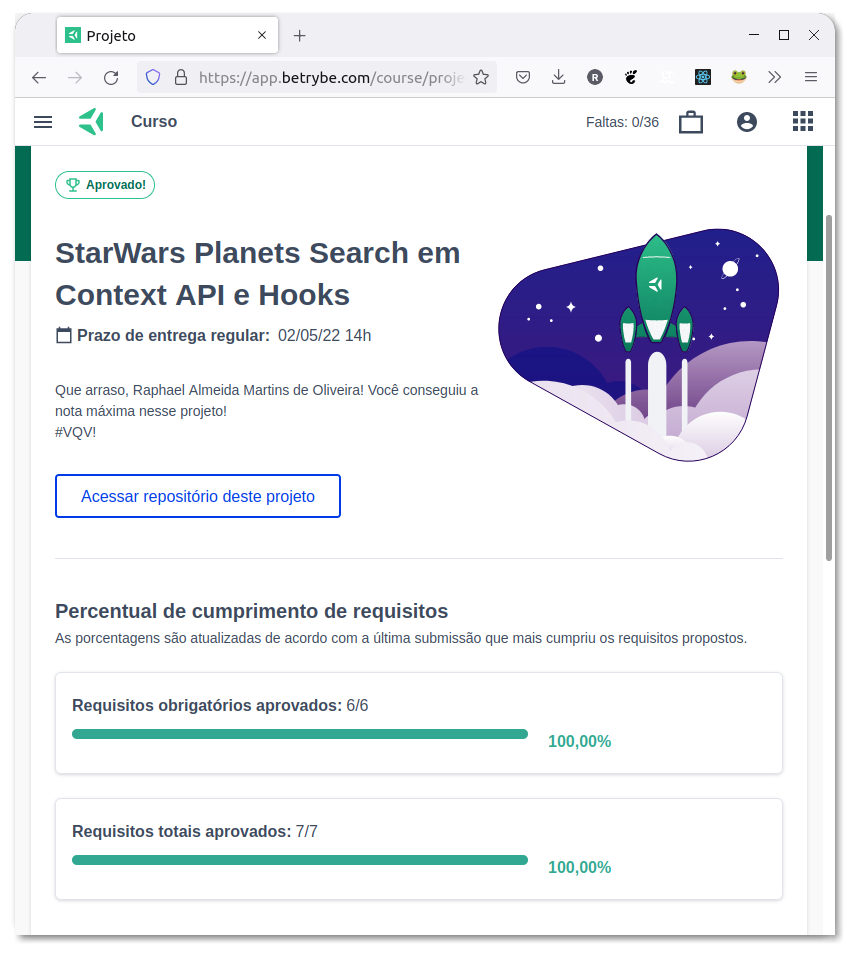

# :alien: StarWars - Planet Search :ringed_planet:

<!--  -->

## :page_with_curl: About

React project developed by [Raphael Martins](https://www.linkedin.com/in/raphaelameidamartins/) at the end of Unit 17 ([Front-end Development Module](https://github.com/raphaelalmeidamartins/trybe_exercicios/tree/main/2_Desenvolvimento-Front-end)) of Trybe's Web Development course. We were approved with 100% of the mandatory and optional requirements met.

We had to develop a table React application fetching for StarWars planets' data from a public API. We also had to use the React Context API for state management.

### Note

This project is still under development. I still implementing the CSS and haven't deployed the application yet.

<!-- [Click here](https://raphaelalmeidamartins.github.io/front-end-online-store/#/) to check out the final version of the project on your browser. -->

<!-- ## :memo: Methodologies

* Mobile First
* Kanban
* Scrum -->

## :man_technologist: Developed Skills

* Develop a React application
* Fetch data from a public API
* Use React Context API for state management

## :hammer_and_wrench: Tools

* HTML5
* CSS3
* Sass
* JavaScript ES6+
* React.js
* React Context API
* React Icons (icon library)
* GitHub Pages

## :iphone: Mobile version

_Under development_
<!--  -->

## :trophy: Grade

### :copyright: Copyright disclaimer

The Star Wars franchise and characters belong to Lucasfilms Limited, all rights reserved. I developed this project for learning purposes, it's not related to the company.
